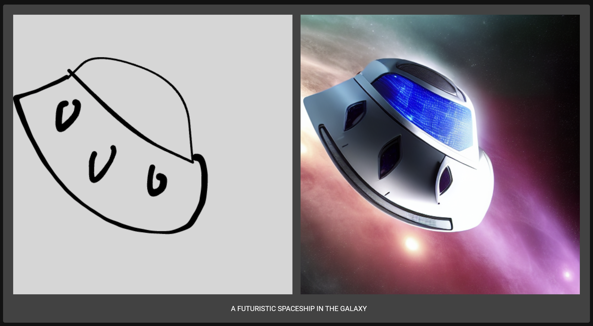
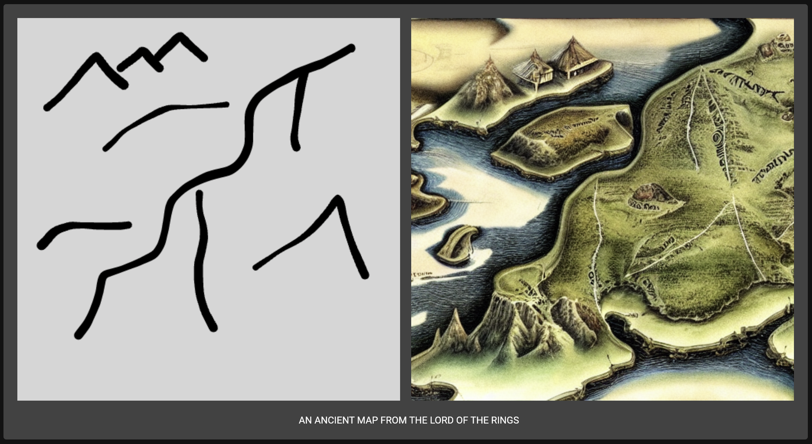
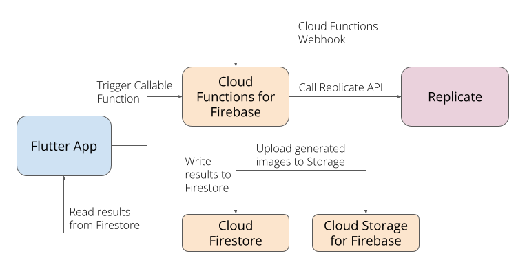

# Flutter Scribble Diffusion

Turn your scribbles into detailed images with AI.

Demo: [flutter-scribble.web.app](https://flutter-scribble.web.app)

---

## Sample Generations

[link](https://flutter-scribble.web.app/#/share/whf7xnpqcnb5bj6udndqde7sbq)

[link](https://flutter-scribble.web.app/#/share/4e425d3xdbftpgry6c4ta3asqe)

## Powered by

🚀 [Replicate](https://replicate.com/), a platform for running machine learning models in the cloud.

🖍️ [ControlNet](https://replicate.com/jagilley/controlnet-scribble/), an open-source machine learning model that generates images from text and scribbles.

🐦 [Flutter](https://flutter.dev/), an open source framework by Google for building beautiful, natively compiled, multi-platform applications from a single codebase.

🔥 [Firebase](https://firebase.google.com/), an app development platform that helps you build and grow apps and games users love.

🔥 ⚡ [Cloud Functions for Firebase](https://firebase.google.com/docs/functions), for talking to the Replicate API.

🔥 📝 [Cloud Firestore](https://firebase.google.com/products/firestore), for storing predictions from Replicate.

🔥 ☁️ [Cloud Storage for Firebase](https://firebase.google.com/products/storage), for saving generated images from Replicate.

🔥 🔐 [Firebase Authentication](https://firebase.google.com/docs/auth), for handling anonymous authentication.

🔥 🕸️ [Firebase Hosting](https://firebase.google.com/docs/hosting), for hosting the Flutter web app.

🖌️ [Perfect Freehand Dart](https://github.com/steveruizok/perfect-freehand-dart), for scribbles in Flutter.

---

---

Inspired by [🖍️ Scribble Diffusion](https://github.com/replicate/scribble-diffusion)
